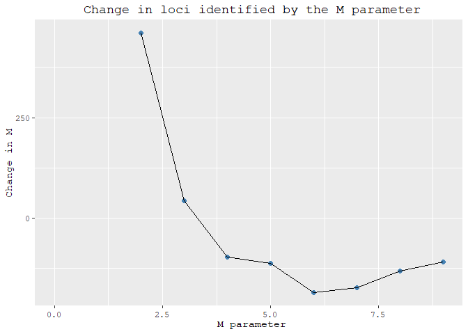
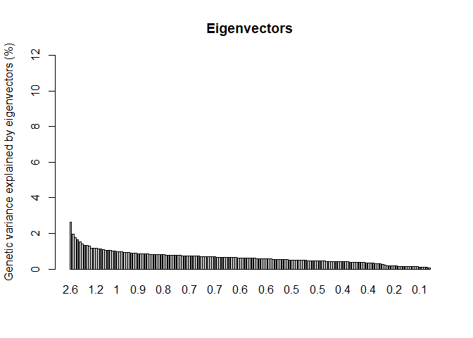
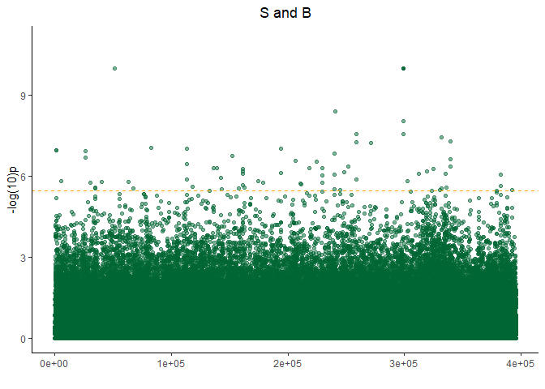
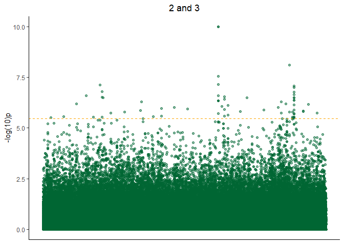
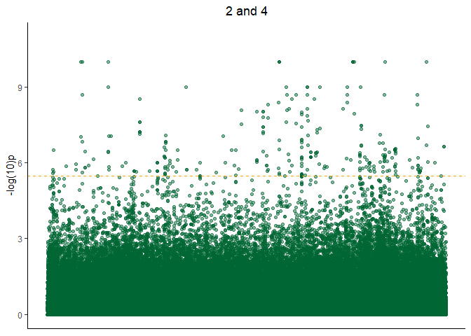
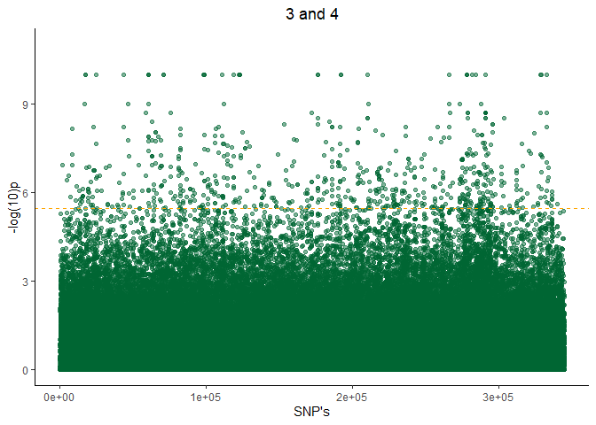
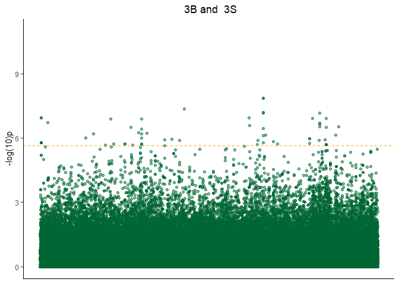
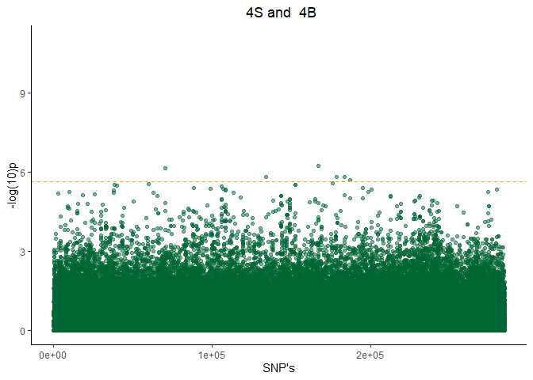

# Stacks on a cluster

### ¿ What's Stacks ?

Stacks is a bioinformatic software useful to analyze short sequence data such as Rad-seq for population genomic research. First, I will work with a dataset previously filtered, to build loci from short sequences, using the command `denovo_map.pl` in the cluster [Hydra](https://confluence.si.edu/display/HPC/High+Performance+Computing).

### `Denovo_map.pl` analysis 

First, we have to log in the cluster, and then place in the computer with the following code:

    pwd

Then we change to direction  in the cluster with the command `cd` :


    cd /scratch/genomics/caballeroeg /

Then, with the command `mkdir` we will create directory  to safe the files generated by  `denovo_map.pl` 

    mkdir -p optimization_denovo/m1 optimization_denovo/m2 optimization_denovo/m3 # and so it goes until we reach m9

We will create 9 folders inside the main "directory" to store the data for further analysis.

### Parameters optimization

`denovo_map.pl` is controled by three [main parameters](https://catchenlab.life.illinois.edu/stacks/param_tut.php) to generate the loci catalogue. The `-m` parameter specify the number of raw reads required to construct an initial stack (depth of coverage), `-M`controls the number of differences allowed between stacks to merge them as independent loci. Lastly, the `-n` parameter compare each loci, of the individuals with the catalogue to identify a loci as polymorphic or independent.

To set the best parameters combinations `-m`, `-M` y `-n` we have to create a subsample of our data, creating a `.txt file` with a part of our data called  `popt.txt`. I created this txt file by choosing randomly 5 individuals from each population with a coverage higher than 60 (>60) :


    1s02<tab>opt
    2s09F<tab>opt
    2s08<tab>opt
    2s25<tab>opt
    ...<tab>opt
    ...

It is important to separate the individuals and the population with  `tab`, otherwise the software will crash with an error. For the parameters test is not important to specify the population, purposely I used the 'opt' as population for all the individuals.

Once we defined our popmap file (popt.txt), the stacks files and the output director, we can execute `denovo_map.pl`, as a job-file:


``` /bin/sh
# ----------------Parameters---------------------- #
#$  -S /bin/sh
#$ -pe mthread 30
#$ -q mThM.q
#$ -l mres=240G,h_data=8G,h_vmem=8G,himem
#$ -cwd
#$ -j y
#$ -N o8
#$ -o o8.log
#$ -m bea
#$ -M caballeroeg@si.edu
#
# ----------------Modules------------------------- #
module load ~/modulefiles/miniconda
source activate ste
#
# ----------------Your Commands------------------- #
#
echo + `date` job $JOB_NAME started in $QUEUE with jobID=$JOB_ID on $HOSTNAME
echo + NSLOTS = $NSLOTS
#
denovo_map.pl -m 3 -M 8 -N 8 --samples /scratch/genomics/caballeroeg/CPrads/clean_rads/ --popmap /scratch/genomics/caballeroeg/optimization_denovo/m1/popt.txt  -o /scratch/genomics/caballeroeg/optimization_denovo/m8   --paired -r 0.8
 
#
echo = `date` job $JOB_NAME done

```
For each parameter test, we will vary the `-M` and `-n` from one to nine. For further details about the parameter ests click [here](https://www.biorxiv.org/content/biorxiv/early/2021/11/04/2021.11.02.466953.full.pdf) and visit the [Stacks website](https://catchenlab.life.illinois.edu/stacks/comp/denovo_map.php).

After finishing all the test, we can extract the quantity of loci generated by each `-M` and `-n` set, using the following command :

    $ cat populations.sumstats.tsv | \
     grep -v '^#' | \ # Remove the comments
     cut -f 1 | \ # Splits the first column (Locus ID)
     sort -n -u | \ #  Sort by numerical order and unique values
     wc -l # count the number of lines
     10065

For instance, for `-M`=1 and `n`=1 the number of polimorphic loci identified was 10065.We will do this for all the parameters and organize it in the following way


```r
optimization <- read.csv("r_80.csv",sep = ";")
optimization
```

```
##   M R_80.populations.sumstat.tsv. change.in._r_80
## 1 1                         10065               -
## 2 2                         10526             461
## 3 3                         10569              43
## 4 4                         10472             -97
## 5 5                         10359            -113
## 6 6                         10173            -186
## 7 7                         10000            -173
## 8 8                          9869            -131
## 9 9                          9760            -109
```

To choose the best *denovo*  parameter, we will have to calculate the difference of loci identified for each parameter combination. For instance, to calculate the difference of loci identified for `-M=2`, we have to substract to `-M=2`  the loci identified in `-M=1`. The positive number closest to zero is considered the best parameter fit.


```
## Warning: NAs introducidos por coerción
```

```
## [1] "numeric"
```

```
## Warning: Use of `optimization$M` is discouraged. Use `M` instead.
```

```
## Warning: Use of `optimization$M` is discouraged. Use `M` instead.
```

```
## Warning: Removed 1 rows containing missing values (geom_point).
```

```
## Warning: Removed 1 row(s) containing missing values (geom_path).
```

<!-- -->
`M1` is not in the plot because it is unlikely possible that all loci are independent,  and the plots starts from `M2`.

### Executing `denovo_map.pl`

After setting the best fit we can run properly `denovo_map.pl` following the next protocol:

    # /bin/sh                                                                                                         
    # ----------------Parameters---------------------- #          
    #$  -S /bin/sh                                                                             
    #$ -pe mthread 30           
    #$ -q mThM.q                                                                                                      
    #$ -l mres=240G,h_data=8G,h_vmem=8G,himem       
    #$ -cwd                                                                                                           
    #$ -j y                                                                                                           
    #$ -N m3p                       
    #$ -o m3p.log                                                                                                     
    #$ -m bea                 
    #$ -M caballeroeg@si.edu
    #                                                                                                                 
    # ----------------Modules------------------------- #                                                              
    module load ~/modulefiles/miniconda                                                                               
    source activate ste
    #                                                                                                           
    # ----------------Your Commands------------------- #     
    #                                                                                                                          
    echo + `date` job $JOB_NAME started in $QUEUE with jobID=$JOB_ID on $HOSTNAME                                     
    echo + NSLOTS = $NSLOTS 

    denovo_map.pl -m 3 -M 3 -N 3 
    --samples /scratch/genomics/caballeroeg/CPrads/clean_rads/   #Directorio donde están los archivos stacks
    --popmap /scratch/genomics/caballer oeg/CPrads/clean_rads/popmp_1.txt  ##population map indicando el individuo y la población
    -o /scratch/genomics/caballeroeg/CPrads/clean_rads/edgar_analysis/m3p/  #Directorio para guardar 
    --paired  #Para nuestras lecturas de pares

    #                                                                                                                          
    echo = `date` job $JOB_NAME done  

In this case, our popmap file follows the next format :

    1s01F<tab>1
    1s01M<tab>1
    1s02<tab>1
    ...
    
    Speciyfing the population of individuals 

We can check the number of loci identified using the next command:

    cat gstacks.log | grep -B 2 -A 3 '^Genotyped'

wchich prints the number of loci generated:

    Genotyped 93683 loci:
      effective per-sample coverage: mean=49.4x, stdev=28.4x, min=4.5x, max=188.2x                                             
      mean number of sites per locus: 465.0                                                                                    
       a consistent phasing was found for 756770 of out 999308 (75.7%) diploid loci needing phasing    

We can also check for individuals with low mean coverage (<10x) and discard them for our further analysis:

     stacks-dist-extract gstacks.log.distribs effective_coverages_per_sample \
     | grep -v '^#' \
     | cut -f 1-2,4-5,8

    # For mean_cov_ns, the coverage at each locus is weighted by the number of                                                 
    # samples present at that locus (i.e. coverage at shared loci counts more).                                                
    sample  n_loci  n_used_fw_reads mean_cov        mean_cov_ns                                                                
    1s01F   15217   600125  39.438  42.716                                                                                     
    1s01M   28001   3383027 120.818 167.263                                                                                    
    1s02    15521   568731  36.643  40.246                                                                                     
    1s03    17532   734543  41.897  48.854                                                                                     
    1s04    16607   1120518 67.473  75.308                                                                                     
    1s05    17848   796382  44.620  52.041                                                                                     
    1s06    17807   938246  52.690  60.962    

In the shell we can pass that information into a `.txt` file with the next command:

    stacks-dist-extract gstacks.log.distribs effective_coverages_per_sample | grep -v '^#' | cut -f 1-2,4-5,8 > raw_cov.txt


Then, we can edit the `raw_cov.txt`using different text editors as [Visual Studio Code](https://code.visualstudio.com), [Notepad++](https://notepad-plus-plus.org/downloads/) o or others depending on your prefferences or your OS.I  would not recommend use a note pad or microsoft word as editors. 

En el editor de texto, abrimos el archivo :

```
sample|depth of|max  |reads  | %reads
      |cov     |cov  |incorpo| incor
------|--------|-----|-------|-----
3Bx42 | 19.37  |278  |375366 |  77.0
3S36  | 14.43  |256  |265521 |  73.3
3S38H | 5.58   |118  |15367  |  38.5
3S39M | 6.32   |181  |77588  |  68.1
```
We are interested in the second column. Those individuals with a depth of coverage below 10 (as 3s38H) will be discarded for upcoming analysis. 


### Populations software

 [`populations`](https://catchenlab.life.illinois.edu/stacks/comp/populations.php) command analyse individuals and calculates genomics statistics as FST, FIS, and export the results in formats as [STRUCTURE](https://web.stanford.edu/group/pritchardlab/structure.html), [plink](https://www.cog-genomics.org/plink/1.9/formats), [genepop](https://www.cog-genomics.org/plink/1.9/formats) to mention some.

    # /bin/sh                                                                                                                  
    # ----------------Parameters---------------------- #                                                                       
    #$  -S /bin/sh                                                                                                             
    #$ -pe mthread 30                                                                                                          
    #$ -q mThM.q                                                                                                               
    #$ -l mres=240G,h_data=8G,h_vmem=8G,himem                                                                                  
    #$ -cwd                                                                                                                    
    #$ -j y                                                                                                                    
    #$ -N paired_populations                                                                                                   
    #$ -o paired_populations.log                                                                                               
    #$ -m bea                                                                                                                  
    #$ -M caballeroeg@si.edu                                                                                                   
    #                                                                                                                          
    # ----------------Modules------------------------- #                                                                       
    module load ~/modulefiles/miniconda                                                                                        
    source activate ste                                                                                                        
    #                                                                                                                          
    # ----------------Your Commands------------------- #                                                                       
    #                                                                                                                          
    echo + `date` job $JOB_NAME started in $QUEUE with jobID=$JOB_ID on $HOSTNAME                                              
    echo + NSLOTS = $NSLOTS                                                                                                    
    #                                                                                                                          
    populations -P /scratch/genomics/caballeroeg/CPrads/clean_rads/edgar_analysis/m3p 
    -M /scratch/genomics/caballeroeg/populations_ana/paired_populations/paired_popmap.txt 
    -O /scratch/genomics/caballeroeg/populations_ana/paired_populations 
    -p 3 
    -r 0.50 
    --fstats 
    --vcf 
    --genepop 
    --structure 
    --treemix 
    --hwe
    #                                                                                                                          
    echo = `date` job $JOB_NAME done

The jobfile is the way we ran the software, the parameter `-p`  controls the minimun number of populations that a locus must be present to process and  `-r` the indicates the minimum percentage of individuals that must contain a locus to process it.

To see the results we run the following command:

    Removed 78826 loci that did not pass sample/population constraints from 93683 loci.
    Kept 14857 loci, composed of 10149843 sites; 86404 of those sites were filtered, 412383 variant sites remained.            
    Number of loci with PE contig: 14857.00 (100.0%);                                                                          
      Mean length of loci: 673.17bp (stderr 0.60);                                                                             
    Number of loci with SE/PE overlap: 14856.00 (100.0%);

In our case we have 14857.

## Faststructure

[Faststructure](https://rajanil.github.io/fastStructure/) is an open source model based algorithm to study populations genetics. It is based on the [Hardy-Weinberg equlibrium](http://bioinformatica.uab.es/base/base3.asp?sitio=geneticapoblaciones&anar=concep&item=Hardy-Weinberg).


### Executing the populations for  FastStructure usage

Primero, we have to execute the populatons command

```
# /bin/sh                                                                                                        
# ----------------Parameters---------------------- #                                                              
#$  -S /bin/sh                                                                                                    
#$ -pe mthread 30                                                                                                 
#$ -q mThM.q                                                                                                      
#$ -l mres=240G,h_data=8G,h_vmem=8G,himem                                                                         
#$ -cwd                                                                                                       
#$ -j y                                                                                                        
#$ -N random_snps_population                                                                                   
#$ -o random_snps_population.log                                                                                  
#$ -m bea                                                                                                         
#$ -M caballeroeg@si.edu                                                                                        
#                                                                                                                 
# ----------------Modules------------------------- #                                                            
module load ~/modulefiles/miniconda                                                                               
source activate ste                                                                                               
#                                                                                                                 
# ----------------Your Commands------------------- #                                                            
#                                                                                                              
echo + `date` job $JOB_NAME started in $QUEUE with jobID=$JOB_ID on $HOSTNAME                                   
echo + NSLOTS = $NSLOTS                                                                                           
#                                                                                                                 
populations -P /scratch/genomics/caballeroeg/CPrads/clean_rads/edgar_analysis/m3p 
-M /scratch/genomics/caballeroeg/populations_ana/paired_populations/paired_popmap.txt 
-O /scratch/genomics/caballeroeg/populations_ana/random_snps_population 
-p 3 -
r 0.50 
--fstats 
--vcf 
--genepop 
--structure 
--treemix 
--hwe 
--write-random-snp
#                                                                                                                          
echo = `date` job $JOB_NAME done   

```
As we see, the jobfile is exactly as the previous one but we habilitated the ouputs formars vcf,genepop,structure,treemix. Plus, the fstats calculates f-statistics, and the loci at Hardy-Wearding equlibrium. Furthermore, for this analysis we used the `write-random-snp`. For our abalysis, we are using the `structure`

Prior executing FastStructure we have to edit the file with [R](https://www.r-project.org), or [Microsft Excel](https://www.microsoft.com/es-es/microsoft-365/excel).


```r
raw_pop <- read.delim('Estructure_data.txt')
raw_pop[1:8,1:8]
```

```
##       X X.1 X1_115 X2_199 X4_491 X6_135 X9_107 X15_302
## 1 1s01F   1      2      2     -9      3      2       3
## 2 1s01F   1      3      2     -9      3      2       3
## 3 1s01M   1      3      2     -9      3      2      -9
## 4 1s01M   1      3      2     -9      3      2      -9
## 5  1s02   1      3      2      4      3      2      -9
## 6  1s02   1      3      2      4      3      2      -9
## 7  1s03   1      3      2     -9      3      2       3
## 8  1s03   1      3      2     -9      3      2       3
```

The structure of the populations file is the following:


* Column 1: Sample ID.

* Column 2: Population.

* Column 3-n: "SNPs" data.
 
 We have to modify this dataset, given that columns 1-6 in fastStructure is metada and not 'SNPS' data. We can add four columns of '#' and substitue 0 with -9. Lastly, our final format is **str**.


Our final file is:


```r
modi <- read.delim('structure_modified.txt')
modi[1:8,1:12]
```

```
##   X. X..1 X..2 X..3 X1s01F X1 X2 X2.1 X.9 X3 X2.2 X3.1
## 1  #    #    #    #  1s01F  1  3    2  -9  3    2    3
## 2  #    #    #    #  1s01M  1  3    2  -9  3    2   -9
## 3  #    #    #    #  1s01M  1  3    2  -9  3    2   -9
## 4  #    #    #    #   1s02  1  3    2   4  3    2   -9
## 5  #    #    #    #   1s02  1  3    2   4  3    2   -9
## 6  #    #    #    #   1s03  1  3    2  -9  3    2    3
## 7  #    #    #    #   1s03  1  3    2  -9  3    2    3
## 8  #    #    #    #   1s04  1  2    2   4  3    2   -9
```

### Executing fastStructure

This is our `jobfile` :

```
Uage: python structure.py
     -K <int>    number of populations assumed
     --input=<file>   (/path/to/'file.str/format/file) #without quotes
     --output=<file>   (/path/to/output/file)
     --tol=<float>   (divergence criterion; 10e-6 by default)
     --prior={simple,logistic}   (by default: simple)
     --cv=<int>   (number of cross validation, 0 implies no validation cross; by default: 0)
     --format={bed,str} (input file format; bed, by default.'str' for our purpose)
     --full   (deploy all the parameters variables; optional)
     --seed=<int>   (specify manually random seed number, optional)

```

Took from [vdreis](https://vdreis.com/faststructure/), which describes how to transform the data for faststucture, and  [fastructure official website](https://rajanil.github.io/fastStructure/). 

The `jobfile` is :


```
# /bin/sh                                                                                                         
# ----------------Parameters---------------------- #
#$ -S /bin/sh                                                                                                   
#$ -pe mthread 30                                                                                                 
#$ -q mThM.q                                                                                                      
#$ -l mres=240G,h_data=8G,h_vmem=8G,himem                   
#$ -cwd                                                                                                         
#$ -j y                                                                                                           
#$ -N k1                                                                                                          
#$ -o K_$TASK_ID.log                                                                                              
#$ -t 1-10                                                                                                        
#$ -m bea                                                                                                
#$ -M caballeroeg@si.edu  
# ----------------Modules------------------------- #                                                              
module load bio/faststructure/1.0                                                                                 
#                                                                                                               
# ----------------Your Commands------------------- #                                                              
#                                                                                                                 
echo + `date` job $JOB_NAME started in $QUEUE with jobID=$JOB_ID on $HOSTNAME                                              

echo + NSLOTS = $NSLOTS                                                                                                    
structure.py -K $SGE_TASK_ID
--input=/scratch/genomics/caballeroeg/FasSTRUCTURE/population
--output=/scratch/genomics/caballeroeg/FasSTRUCTURE/K 
--prior=simple 
--format=str 
--full 
--tol=10e-6 
```


We are interested in a the genomic structure from five sample sites. So, I ran k from one to ten (K 1-10), and compared the best fit for the data using the command `ChooseK.py` :

```
# ----------------Parameters---------------------- #                                                              
#$ -S /bin/sh                                                                                                     
#$ -pe mthread 30                                                                             
#$ -q mThM.q                                                                                                      
#$ -l mres=240G,h_data=8G,h_vmem=8G,himem 
#$ -cwd                                                                                                           
#$ -j y                                                                                                           
#$ -N best                                                              
#$ -o best_k.log  
#$ -m bea                                                                                                         
#$ -M caballeroeg@si.edu
# 
# ----------------Modules------------------------- #          
module load bio/faststructure/1.0
#                                                                                                                 
# ----------------Your Commands------------------- #                                                              
#                                                                                                                          
echo + `date` job $JOB_NAME started in $QUEUE with jobID=$JOB_ID on $HOSTNAME                                              
echo + NSLOTS = $NSLOTS                                                                                           
chooseK.py --input=/scratch/genomics/caballeroeg/FasSTRUCTURE/K_                                                  
```

Our output is :

```
Model complexity that maximizes marginal likelihood = 1                                                                    
Model components used to explain structure in data = 1 

```


 We can also plot the results using the following command:
 
```
# ----------------Parameters---------------------- #                                                              
#$ -S /bin/sh                                                                                                     
#$ -pe mthread 30                                                                             
#$ -q mThM.q                                                                                                      
#$ -l mres=240G,h_data=8G,h_vmem=8G,himem 
#$ -cwd                                                                                                           
#$ -j y                                                                                                           
#$ -N best                                                              
#$ -o best_k.log  
#$ -m bea                                                                                                         
#$ -M caballeroeg@si.edu
# 
# ----------------Modules------------------------- #          
module load bio/faststructure/1.0
#                                                                                                                 
# ----------------Your Commands------------------- #   

#                                                                                                                          
echo + `date` job $JOB_NAME started in $QUEUE with jobID=$JOB_ID on $HOSTNAME                                              
echo + NSLOTS = $NSLOTS  

distruct.py \          
-K $SGE_TASK_ID \                                                                                                 
--input=/scratch/genomics/caballeroeg/FasSTRUCTURE/k$SGE_TASK_ID/K_$SGE_TASK_ID \                                 
--output=/scratch/genomics/caballeroeg/FasSTRUCTURE/K$SGE_TASK_ID \                                               
--popfile=/scratch/genomics/caballeroeg/FasSTRUCTURE/popfile.txt                                                  
--title=K-means $SGE_TASK_ID  
```

### PCA Analysis


I performed a PCA analysis using the [adegenet package](https://adegenet.r-forge.r-project.org) on Rstudio, to understand how spreaded the data is. To do that we have to export our populations file with the extension `.genepop` to our computer. Then on Rstudio we have to do this :


```r
# Loading the packages.

library(poppr)
```

```
## Loading required package: adegenet
```

```
## Loading required package: ade4
```

```
## 
##    /// adegenet 2.1.6 is loaded ////////////
## 
##    > overview: '?adegenet'
##    > tutorials/doc/questions: 'adegenetWeb()' 
##    > bug reports/feature requests: adegenetIssues()
```

```
## Registered S3 method overwritten by 'pegas':
##   method      from
##   print.amova ade4
```

```
## This is poppr version 2.9.3. To get started, type package?poppr
## OMP parallel support: available
```

```r
library(adegenet)
library(ape)
library(pegas)
```

```
## 
## Attaching package: 'pegas'
```

```
## The following object is masked from 'package:ape':
## 
##     mst
```

```
## The following object is masked from 'package:ade4':
## 
##     amova
```

```r
library(seqinr)
```

```
## 
## Attaching package: 'seqinr'
```

```
## The following objects are masked from 'package:ape':
## 
##     as.alignment, consensus
```

```r
library(ggplot2)
library(dplyr)
```

```
## 
## Attaching package: 'dplyr'
```

```
## The following object is masked from 'package:seqinr':
## 
##     count
```

```
## The following objects are masked from 'package:stats':
## 
##     filter, lag
```

```
## The following objects are masked from 'package:base':
## 
##     intersect, setdiff, setequal, union
```

```r
library(hierfstat)
```

```
## 
## Attaching package: 'hierfstat'
```

```
## The following objects are masked from 'package:ape':
## 
##     pcoa, varcomp
```

```
## The following objects are masked from 'package:adegenet':
## 
##     Hs, read.fstat
```

```r
library(reshape2)
library(RColorBrewer)

## read the data
obj1 <- read.genepop('populations.snps.gen')
```

```
## 
##  Converting data from a Genepop .gen file to a genind object... 
## 
## 
## File description:  # Stacks v2.61; GenePop v4.1.3; May 23, 2022 
## 
## ...done.
```

```r
obj1
```

```
## /// GENIND OBJECT /////////
## 
##  // 156 individuals; 14,176 loci; 28,352 alleles; size: 24.4 Mb
## 
##  // Basic content
##    @tab:  156 x 28352 matrix of allele counts
##    @loc.n.all: number of alleles per locus (range: 2-2)
##    @loc.fac: locus factor for the 28352 columns of @tab
##    @all.names: list of allele names for each locus
##    @ploidy: ploidy of each individual  (range: 2-2)
##    @type:  codom
##    @call: read.genepop(file = "populations.snps.gen")
## 
##  // Optional content
##    @pop: population of each individual (group size range: 26-36)
```

```r
is.genind(obj1)
```

```
## [1] TRUE
```

```r
#tab(obj1)
obj1$tab[1:5,1:10]
```

```
##       1_168.04 1_168.01 2_276.02 2_276.04 4_390.04 4_390.01 6_225.02 6_225.04
## 1s01F        2        0        2        0        2        0        2        0
## 1s01M        2        0        2        0        2        0        2        0
## 1s02         2        0        2        0        2        0        2        0
## 1s03         2        0        2        0        2        0        2        0
## 1s04         2        0        2        0        2        0        2        0
##       9_448.02 9_448.01
## 1s01F        2        0
## 1s01M        2        0
## 1s02         2        0
## 1s03         2        0
## 1s04         2        0
```


After setting the dataset, we are going to perform the PCA :


```r
x<- tab(obj1, freq=TRUE, NA.method="mean")

pca1 = dudi.pca(x,scannf = F, scale = F,center = T,nf = 3 )
pca1
```

```
## Duality diagramm
## class: pca dudi
## $call: dudi.pca(df = x, center = T, scale = F, scannf = F, nf = 3)
## 
## $nf: 3 axis-components saved
## $rank: 155
## eigen values: 15.77 11.84 10.53 9.95 9.152 ...
##   vector length mode    content       
## 1 $cw    28352  numeric column weights
## 2 $lw    156    numeric row weights   
## 3 $eig   155    numeric eigen values  
## 
##   data.frame nrow  ncol  content             
## 1 $tab       156   28352 modified array      
## 2 $li        156   3     row coordinates     
## 3 $l1        156   3     row normed scores   
## 4 $co        28352 3     column coordinates  
## 5 $c1        28352 3     column normed scores
## other elements: cent norm
```
Now, we can visualize what percentage of the variance is explained by our variables.


```r
percent = pca1$eig/sum(pca1$eig)*100
barplot(percent, ylab = "Genetic variance explained by eigenvectors (%)", ylim = c(0,12),
        names.arg = round(percent, 1), main="Eigenvectors")
```

<!-- -->


To know more about how to visualize the PCA, you can check [this website](https://tomjenkins.netlify.app/tutorials/r-popgen-getting-started/), which I used as template to perform this PCA and [this site](https://adegenet.r-forge.r-project.org/files/tutorial-basics.pdf) as well.


### FST outliers comparison.

In order to identify SNPS under selective pressure for a particular, phenotypic variable as the host-plant or the altitudinal gradient. We ran the `populations.pl` command twice, one comparing the host-plant insects (S-B) and the altitudinal gradient (sites 2,3,4). Then the `Fisher's p value` of each `SNP` was transformed using a `-log 10 p` algorithm on `R studio` and performed a bonferroni correction to calculate a threshold to identify with a High FST value. Here is the code for both comparisons :


#### Host- plants comparisons


```r
library(ggplot2)
library(ggpubr)
```

```
## 
## Attaching package: 'ggpubr'
```

```
## The following object is masked from 'package:ape':
## 
##     rotate
```

```r
library(readr)

sb_table <- read_tsv('C:/Users/edgar/Dropbox/git-hub-page/A_grossa-research/PCA_fst_analysis/SB/populations.fst_s-b.tsv')
```

```
## Rows: 395923 Columns: 14
```

```
## ── Column specification ────────────────────────────────────────────────────────
## Delimiter: "\t"
## chr  (3): Pop 1 ID, Pop 2 ID, Chr
## dbl (11): # Locus ID, BP, Column, Fisher's P, Odds Ratio, CI Low, CI High, L...
## 
## ℹ Use `spec()` to retrieve the full column specification for this data.
## ℹ Specify the column types or set `show_col_types = FALSE` to quiet this message.
```

```r
sb_table$bpfake <- 1:nrow(sb_table)
sb_table$p_log_transform <- -log10(sb_table$`Fisher's P`)
sb_table$p_log_transform[sb_table$p_log_transform =='Inf' ]= 10
View(sb_table)

bonferroni_correction <- -log10(0.05/14490) ## number of loci
plot_sb <- ggplot(data = sb_table) + geom_point(aes(x= bpfake, y= p_log_transform), alpha = 0.5, color = '#006633') + theme_classic() + ggtitle("S and B") + xlab("") + geom_hline(yintercept =5.46, color = "orange", linetype = "dashed") + theme(plot.title = element_text(hjust = 0.5)) + ylim(0,11.0) + ylab('-log(10)p')
plot_sb
```

<!-- -->

#### Altitudinal gradient comparisons

Comparison Site 2-3

```r
## Read the tables
d2_3 <- read_tsv("C:/Users/edgar/Dropbox/git-hub-page/A_grossa-research/PCA_fst_analysis/dist_pop/populations.fst_2-3.tsv")
```

```
## Rows: 309900 Columns: 14
## ── Column specification ────────────────────────────────────────────────────────
## Delimiter: "\t"
## chr  (1): Chr
## dbl (13): # Locus ID, Pop 1 ID, Pop 2 ID, BP, Column, Fisher's P, Odds Ratio...
## 
## ℹ Use `spec()` to retrieve the full column specification for this data.
## ℹ Specify the column types or set `show_col_types = FALSE` to quiet this message.
```

```r
##Add a column to improve the visualization of the SNPS
d2_3$bpfake <- 1:nrow(d2_3)

##add a -log10 column
d2_3$p_log_transform <- -log10(d2_3$`Fisher's P`)

## replace 'inf' values for numerical values
d2_3$p_log_transform[d2_3$p_log_transform =='Inf' ]= 10

##Bonferroni correction
bonferroni_correction_ds <- -log10(0.05/14819)

plog_23 <- ggplot(data = d2_3) + geom_point(aes(x= bpfake, y= p_log_transform), alpha = 0.5, color = '#006633') + theme_classic() + ggtitle("2 and 3") + xlab("") + geom_hline(yintercept =5.47, color = "orange", linetype = "dashed") + theme(plot.title = element_text(hjust = 0.5),axis.title.x=element_blank(),axis.text.x=element_blank(),axis.ticks.x=element_blank()) + ylab('-log(10)p')
plog_23
```

<!-- -->

Comparison site 2-4


```r
d2_4 <- read_tsv("C:/Users/edgar/Dropbox/git-hub-page/A_grossa-research/PCA_fst_analysis/dist_pop/populations.fst_2-4.tsv")
```

```
## Rows: 340697 Columns: 14
## ── Column specification ────────────────────────────────────────────────────────
## Delimiter: "\t"
## chr  (1): Chr
## dbl (13): # Locus ID, Pop 1 ID, Pop 2 ID, BP, Column, Fisher's P, Odds Ratio...
## 
## ℹ Use `spec()` to retrieve the full column specification for this data.
## ℹ Specify the column types or set `show_col_types = FALSE` to quiet this message.
```

```r
d2_4$bpfake <- 1:nrow(d2_4)

d2_4$p_log_transform <- -log10(d2_4$`Fisher's P`)

d2_4$p_log_transform[d2_4$p_log_transform =='Inf' ]= 10

plog_24 <- ggplot(data = d2_4) + geom_point(aes(x= bpfake, y= p_log_transform), alpha = 0.5, color = '#006633') + theme_classic() + ggtitle("2 and 4") + xlab("") + geom_hline(yintercept =5.47, color = "orange", linetype = "dashed") +theme(plot.title = element_text(hjust=0.5),axis.title.x=element_blank(),axis.text.x=element_blank(),axis.ticks.x=element_blank()) + ylim(0,11.0) + ylab('-log(10)p')
plog_24
```

<!-- -->
Comparison sites 3-4


```r
d3_4 <- read_tsv("C:/Users/edgar/Dropbox/git-hub-page/A_grossa-research/PCA_fst_analysis/dist_pop/populations.fst_3-4.tsv")
```

```
## Rows: 344682 Columns: 14
## ── Column specification ────────────────────────────────────────────────────────
## Delimiter: "\t"
## chr  (1): Chr
## dbl (13): # Locus ID, Pop 1 ID, Pop 2 ID, BP, Column, Fisher's P, Odds Ratio...
## 
## ℹ Use `spec()` to retrieve the full column specification for this data.
## ℹ Specify the column types or set `show_col_types = FALSE` to quiet this message.
```

```r
d3_4$bpfake <- 1:nrow(d3_4)


d3_4$p_log_transform <- -log10(d3_4$`Fisher's P`)

d3_4$p_log_transform[d3_4$p_log_transform =='Inf' ]= 10

plog_34 <- ggplot(data = d3_4) + geom_point(aes(x= bpfake, y= p_log_transform), alpha = 0.5, color = '#006633') + theme_classic() + ggtitle("3 and 4") + xlab("SNP's") + geom_hline(yintercept =5.47, color = "orange", linetype = "dashed") + theme(plot.title = element_text(hjust = 0.5)) + ylim(0,11.0) + ylab('-log(10)p')
plog_34
```

<!-- -->


### Matching  Outliers snps

After we identified the outliers snps for each comparison. We matched the SNPS across comparisons to target potential SNPS candidate that can be related to adapation.

Here is the code:

Looking for SNPS in the altitudinal gradient comparison:

```
p23 <- d2_3[d2_3$p_log_transform >= 5.47,] #67 snps
p23
View(p23)
p24 <- d2_4[d2_4$p_log_transform >= 5.47,] # 271 snps
p24
View(p24)
p34 <- d3_4[d3_4$p_log_transform >= 5.47,] # 671 snps
p34
View(p34)


## creating a subset with the locus ID 
library(dplyr)
pi23 <- p23 %>% select(`# Locus ID`) #67 snps
View(pi23)
pi24 <- p24 %>% select(`# Locus ID`) #271 snps
View(pi24)
pi34 <- p34 %>% select(`# Locus ID`) # 671 snps
View(pi34)

## intersect 

## intersect 23/24 | 23/34 | 24/34

loci_23_24 <- generics::intersect(pi23,pi24)  # Apply intersect function to compare ahres snps candidates
View(loci_23_24) # 1 locus '32483'

loci_23_34 <- generics::intersect(pi23,pi34)  # Apply intersect function to compare ahres snps candidates
View(loci_23_34) # 12 loci

loci_24_34 <- generics::intersect(pi24,pi34)  # Apply intersect function to compare ahres snps candidates
View(loci_24_34) # 22 loci


loci_2 <- generics::intersect(loci_23_24,loci_23_34)  # Apply intersect function to compare ahres snps candidates
View(loci_2) ## no share.

loci_3 <- generics::intersect(loci_23_34,loci_24_34)  # Apply intersect function to compare ahres snps candidates
View(loci_3) ## no share
```
Here is the comparison for the S-B. Additionally I compared the S-B pairwaise with subsets from the site. Here is the result.


```r
## Adding the additional plots

p5 <- read_tsv("C:/Users/edgar/Dropbox/git-hub-page/A_grossa-research/PCA_fst_analysis/populations.fst_2-3.tsv") #calling the file
```

```
## Rows: 249676 Columns: 14
## ── Column specification ────────────────────────────────────────────────────────
## Delimiter: "\t"
## chr  (1): Chr
## dbl (13): # Locus ID, Pop 1 ID, Pop 2 ID, BP, Column, Fisher's P, Odds Ratio...
## 
## ℹ Use `spec()` to retrieve the full column specification for this data.
## ℹ Specify the column types or set `show_col_types = FALSE` to quiet this message.
```

```r
p5
```

```
## # A tibble: 249,676 × 14
##    # Locus …¹ Pop 1…² Pop 2…³ Chr      BP Column Fishe…⁴ Odds …⁵ CI Lo…⁶ CI Hi…⁷
##         <dbl>   <dbl>   <dbl> <chr> <dbl>  <dbl>   <dbl>   <dbl>   <dbl>   <dbl>
##  1          1       2       3 un       85     84  1        1.01   0.359     2.85
##  2          1       2       3 un      116    115  0.429    0.576  0.202     1.65
##  3          1       2       3 un      118    117  1        0.864  0.0527   14.2 
##  4          1       2       3 un      151    150  1        1.76   0.155    20.0 
##  5          1       2       3 un      204    203  0.464    0.426  0.0376    4.84
##  6          1       2       3 un      207    206  0.0358   7.85   0.947    65.0 
##  7          1       2       3 un      247    246  1        0.954  0.446     2.04
##  8          1       2       3 un      299    298  0.510    0.56   0.148     2.12
##  9          1       2       3 un      312    311  0.370    3.62   0.390    33.5 
## 10          1       2       3 un      322    321  0.201    0.263  0.0265    2.62
## # … with 249,666 more rows, 4 more variables: LOD <dbl>, `AMOVA Fst` <dbl>,
## #   `Smoothed AMOVA Fst` <dbl>, `Smoothed AMOVA Fst P-value` <dbl>, and
## #   abbreviated variable names ¹​`# Locus ID`, ²​`Pop 1 ID`, ³​`Pop 2 ID`,
## #   ⁴​`Fisher's P`, ⁵​`Odds Ratio`, ⁶​`CI Low`, ⁷​`CI High`
## # ℹ Use `print(n = ...)` to see more rows, and `colnames()` to see all variable names
```

```r
p5$bpfake <- 1:nrow(p5)  #adding the fake bp
p5$p_log_transform <- -log10(p5$`Fisher's P`)
max(p5$p_log_transform)
```

```
## [1] 7.853872
```

```r
p5$p_log_transform[p5$p_log_transform =='Inf' ]= 10
p5
```

```
## # A tibble: 249,676 × 16
##    # Locus …¹ Pop 1…² Pop 2…³ Chr      BP Column Fishe…⁴ Odds …⁵ CI Lo…⁶ CI Hi…⁷
##         <dbl>   <dbl>   <dbl> <chr> <dbl>  <dbl>   <dbl>   <dbl>   <dbl>   <dbl>
##  1          1       2       3 un       85     84  1        1.01   0.359     2.85
##  2          1       2       3 un      116    115  0.429    0.576  0.202     1.65
##  3          1       2       3 un      118    117  1        0.864  0.0527   14.2 
##  4          1       2       3 un      151    150  1        1.76   0.155    20.0 
##  5          1       2       3 un      204    203  0.464    0.426  0.0376    4.84
##  6          1       2       3 un      207    206  0.0358   7.85   0.947    65.0 
##  7          1       2       3 un      247    246  1        0.954  0.446     2.04
##  8          1       2       3 un      299    298  0.510    0.56   0.148     2.12
##  9          1       2       3 un      312    311  0.370    3.62   0.390    33.5 
## 10          1       2       3 un      322    321  0.201    0.263  0.0265    2.62
## # … with 249,666 more rows, 6 more variables: LOD <dbl>, `AMOVA Fst` <dbl>,
## #   `Smoothed AMOVA Fst` <dbl>, `Smoothed AMOVA Fst P-value` <dbl>,
## #   bpfake <int>, p_log_transform <dbl>, and abbreviated variable names
## #   ¹​`# Locus ID`, ²​`Pop 1 ID`, ³​`Pop 2 ID`, ⁴​`Fisher's P`, ⁵​`Odds Ratio`,
## #   ⁶​`CI Low`, ⁷​`CI High`
## # ℹ Use `print(n = ...)` to see more rows, and `colnames()` to see all variable names
```

```r
attach(p5) #Attach the names of the columns without typing the dataframe using the "$"


p3b_3s <- ggplot(data = p5) + geom_point(aes(x= bpfake, y= -log10(`Fisher's P`)),alpha = 0.5, color = '#006633') + theme_classic() + ggtitle(" 3B and  3S") + xlab("") + geom_hline(yintercept =5.65, color = "orange", linetype = "dashed") + theme(plot.title = element_text(hjust = 0.5),axis.title.x=element_blank(),axis.text.x=element_blank(),axis.ticks.x=element_blank()) + ylim(0,11) + ylab('-log(10)p')
p3b_3s
```

<!-- -->


```r
## additonal plot 2
p10 <- read_tsv("C:/Users/edgar/Dropbox/git-hub-page/A_grossa-research/PCA_fst_analysis/populations.fst_4-5.tsv") #calling the file
```

```
## Rows: 284742 Columns: 14
## ── Column specification ────────────────────────────────────────────────────────
## Delimiter: "\t"
## chr  (1): Chr
## dbl (13): # Locus ID, Pop 1 ID, Pop 2 ID, BP, Column, Fisher's P, Odds Ratio...
## 
## ℹ Use `spec()` to retrieve the full column specification for this data.
## ℹ Specify the column types or set `show_col_types = FALSE` to quiet this message.
```

```r
p10
```

```
## # A tibble: 284,742 × 14
##    # Locus …¹ Pop 1…² Pop 2…³ Chr      BP Column Fishe…⁴ Odds …⁵ CI Lo…⁶ CI Hi…⁷
##         <dbl>   <dbl>   <dbl> <chr> <dbl>  <dbl>   <dbl>   <dbl>   <dbl>   <dbl>
##  1          1       4       5 un       85     84   0.576   1.53   0.512     4.60
##  2          1       4       5 un      116    115   1       0.825  0.219     3.12
##  3          1       4       5 un      118    117   0.233   0.304  0.0309    3.00
##  4          1       4       5 un      169    168   1       1.8    0.159    20.3 
##  5          1       4       5 un      207    206   0.515   0.566  0.152     2.11
##  6          1       4       5 un      229    228   1       1.8    0.159    20.3 
##  7          1       4       5 un      235    234   0.471   0.438  0.0388    4.95
##  8          1       4       5 un      247    246   1       0.989  0.437     2.24
##  9          1       4       5 un      299    298   1       0.971  0.245     3.85
## 10          1       4       5 un      312    311   0.197   0.223  0.0242    2.05
## # … with 284,732 more rows, 4 more variables: LOD <dbl>, `AMOVA Fst` <dbl>,
## #   `Smoothed AMOVA Fst` <dbl>, `Smoothed AMOVA Fst P-value` <dbl>, and
## #   abbreviated variable names ¹​`# Locus ID`, ²​`Pop 1 ID`, ³​`Pop 2 ID`,
## #   ⁴​`Fisher's P`, ⁵​`Odds Ratio`, ⁶​`CI Low`, ⁷​`CI High`
## # ℹ Use `print(n = ...)` to see more rows, and `colnames()` to see all variable names
```

```r
p10$bpfake <- 1:nrow(p10)  #adding the fake bp
p10$p_log_transform <- -log10(p10$`Fisher's P`)
max(p10$p_log_transform)
```

```
## [1] 6.244888
```

```r
#View(p10)
p10$p_log_transform[p10$p_log_transform =='Inf' ]= 10
p10
```

```
## # A tibble: 284,742 × 16
##    # Locus …¹ Pop 1…² Pop 2…³ Chr      BP Column Fishe…⁴ Odds …⁵ CI Lo…⁶ CI Hi…⁷
##         <dbl>   <dbl>   <dbl> <chr> <dbl>  <dbl>   <dbl>   <dbl>   <dbl>   <dbl>
##  1          1       4       5 un       85     84   0.576   1.53   0.512     4.60
##  2          1       4       5 un      116    115   1       0.825  0.219     3.12
##  3          1       4       5 un      118    117   0.233   0.304  0.0309    3.00
##  4          1       4       5 un      169    168   1       1.8    0.159    20.3 
##  5          1       4       5 un      207    206   0.515   0.566  0.152     2.11
##  6          1       4       5 un      229    228   1       1.8    0.159    20.3 
##  7          1       4       5 un      235    234   0.471   0.438  0.0388    4.95
##  8          1       4       5 un      247    246   1       0.989  0.437     2.24
##  9          1       4       5 un      299    298   1       0.971  0.245     3.85
## 10          1       4       5 un      312    311   0.197   0.223  0.0242    2.05
## # … with 284,732 more rows, 6 more variables: LOD <dbl>, `AMOVA Fst` <dbl>,
## #   `Smoothed AMOVA Fst` <dbl>, `Smoothed AMOVA Fst P-value` <dbl>,
## #   bpfake <int>, p_log_transform <dbl>, and abbreviated variable names
## #   ¹​`# Locus ID`, ²​`Pop 1 ID`, ³​`Pop 2 ID`, ⁴​`Fisher's P`, ⁵​`Odds Ratio`,
## #   ⁶​`CI Low`, ⁷​`CI High`
## # ℹ Use `print(n = ...)` to see more rows, and `colnames()` to see all variable names
```

```r
attach(p10) #Attach the names of the columns without typing the dataframe using the "$"
```

```
## The following objects are masked from p5:
## 
##     # Locus ID, AMOVA Fst, BP, bpfake, Chr, CI High, CI Low, Column,
##     Fisher's P, LOD, Odds Ratio, p_log_transform, Pop 1 ID, Pop 2 ID,
##     Smoothed AMOVA Fst, Smoothed AMOVA Fst P-value
```

```r
p4s_4b <- ggplot(data = p10) + geom_point(aes(x= bpfake, y= p10$p_log_transform ),alpha = 0.5, color = '#006633') + theme_classic() + ggtitle(" 4S and  4B") + xlab("SNP's")  + geom_hline(yintercept =5.65, color = "orange", linetype = "dashed")+ theme(plot.title = element_text(hjust = 0.5)) + ylim(0,11) + ylab('-log(10)p')
p4s_4b
```

<!-- -->


Comparison S-B

```
psb <- sb_table[sb_table$p_log_transform >= 5.46,] #73 snps
psb
View(psb)
p3bs <- p5[p5$p_log_transform >= 5.65,] # 63 snps
p3bs
View(p3bs)
p4bs <- p10[p10$p_log_transform >= 5.65,] # 6snps
p4bs
View(p4bs)

## creating a subset with the locus ID 
library(dplyr)
pisb <- psb %>% select(`# Locus ID`) #67 snps
View(pisb)
pi3bs <- p3bs %>% select(`# Locus ID`) #271 snps
View(pi3bs)
pi4bs <- p4bs %>% select(`# Locus ID`) # 671 snps
View(pi4bs)


## intersect SB/3bs | SB/4bs | 3bs/4bs

loci_sb_3bs <- generics::intersect(pisb,pi3bs)  # Apply intersect function to compare ahres snps candidates
View(loci_sb_3bs) # 6  locus

loci_sb_4bs <- generics::intersect(pisb,pi4bs)  # Apply intersect function to compare ahres snps candidates
View(loci_sb_4bs) # 0

loci_3bs_4bs <- generics::intersect(pi3bs,pi4bs)  # Apply intersect function to compare ahres snps candidates
View(loci_3bs_4bs) # 0

loci_s2 <- generics::intersect(loci_sb_3bs,loci_sb_4bs)  # Apply intersect function to compare ahres snps candidates
View(loci_s2) ## no share.

loci_s3 <- generics::intersect(loci_sb_3bs,loci_3bs_4bs)  # Apply intersect function to compare ahres snps candidates
View(loci_s3) ## no share

```

